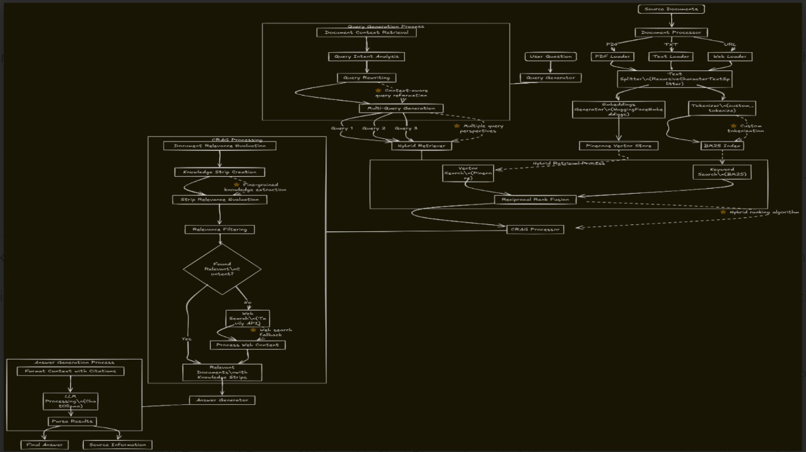

# Synergistic RAG System 🤖

**Advanced Retrieval-Augmented Generation with Contextual Intelligence**

The Synergistic RAG System represents a next-generation approach to knowledge retrieval and response generation. Unlike traditional RAG systems that rely on simple similarity matching, our system employs sophisticated contextual evaluation, hybrid retrieval strategies, and intelligent document processing to deliver highly accurate and contextually relevant responses.

## 🧠 System Architecture & Algorithm Flow



The system follows a sophisticated multi-stage pipeline that combines the strengths of different retrieval methods with intelligent contextual evaluation:

### 1. **Query Processing & Enhancement**
- **Multi-Query Generation**: Automatically generates multiple query variations to improve retrieval coverage
- **Query Intent Analysis**: Understands the core information need and extracts relevant search terms
- **Query Rewriting**: Optimizes queries for better retrieval performance using document context

### 2. **Hybrid Retrieval Engine**
- **Vector Search (Pinecone)**: Semantic similarity using BAAI/bge-m3 embeddings (1024 dimensions)
- **Keyword Search (BM25)**: Traditional term-frequency based retrieval for exact matches
- **Reciprocal Rank Fusion (RRF)**: Intelligently combines results from both methods

### 3. **Contextual RAG (CRAG) Processing**
- **Document Relevance Evaluation**: AI-powered assessment of document relevance to the query
- **Knowledge Strip Extraction**: Breaks documents into meaningful, self-contained knowledge units
- **Strip Relevance Scoring**: Evaluates each knowledge strip for query relevance
- **Web Search Fallback**: Automatically triggers web search when local knowledge is insufficient

### 4. **Intelligent Response Generation**
- **Context Assembly**: Combines relevant knowledge strips into coherent context
- **Source Citation**: Maintains traceability with detailed source references
- **Response Synthesis**: Generates comprehensive answers using contextually relevant information

## ✨ Key Features

### **🔍 Advanced Retrieval**
- **Hybrid Search**: Combines semantic and keyword-based retrieval for comprehensive coverage
- **Multi-Query Processing**: Generates and processes multiple query variations simultaneously
- **Intelligent Fusion**: Uses RRF to merge results from different retrieval methods optimally

### **🧩 Contextual Intelligence**
- **Document Evaluation**: AI-powered relevance assessment before response generation
- **Knowledge Extraction**: Breaks documents into meaningful, query-relevant knowledge strips
- **Adaptive Processing**: Adjusts processing strategy based on content quality and relevance

### **🌐 Multi-Source Integration**
- **Document Formats**: PDF, CSV, TXT files, and web pages
- **Web Search**: Tavily-powered web search for knowledge augmentation
- **Source Transparency**: Detailed citations with relevance scores and content previews

### **💻 Interactive Interface**
- **Real-time Chat**: Streamlit-based conversational interface
- **Source Visualization**: View retrieved documents and their relevance scores
- **System Monitoring**: Track processing steps and performance metrics

### **🔧 Production Ready**
- **Logging**: Comprehensive logging with Loguru for monitoring and debugging
- **Error Handling**: Graceful error recovery and user feedback
- **Performance Optimization**: LLM caching and efficient processing pipelines

## 🏗️ Technical Architecture

```
┌─────────────────────────────────────────────────────────────────┐
│                    Synergistic RAG System                      │
├─────────────────────────────────────────────────────────────────┤
│  Frontend (Streamlit)                                          │
│  ├── Chat Interface                                            │
│  ├── Document Management                                       │
│  └── Source Visualization                                      │
├─────────────────────────────────────────────────────────────────┤
│  Core RAG Engine (vector.py)                                   │
│  ├── Query Processing                                          │
│  │   ├── Multi-Query Generation                               │
│  │   ├── Intent Analysis                                      │
│  │   └── Query Rewriting                                      │
│  ├── Hybrid Retrieval                                         │
│  │   ├── Vector Search (Pinecone + BGE-M3)                   │
│  │   ├── Keyword Search (BM25)                               │
│  │   └── Reciprocal Rank Fusion                              │
│  ├── CRAG Processing                                          │
│  │   ├── Document Relevance Evaluation                       │
│  │   ├── Knowledge Strip Extraction                          │
│  │   └── Web Search Integration                              │
│  └── Response Generation                                       │
│      ├── Context Assembly                                     │
│      ├── Source Citation                                      │
│      └── Answer Synthesis                                     │
├─────────────────────────────────────────────────────────────────┤
│  External Services                                             │
│  ├── Pinecone (Vector Database)                               │
│  ├── Ollama (LLM - qwen2.5-coder:1.5b)                       │
│  └── Tavily (Web Search API)                                  │
└─────────────────────────────────────────────────────────────────┘
```

## 🚀 Quick Start

### Prerequisites
- Python 3.11+
- Pinecone API key
- Ollama installed locally
- Tavily API key (optional, for web search)

### Installation

1. **Clone and Setup**
   ```bash
   git clone <repository-url>
   cd synergistic-rag
   ```

2. **Install Dependencies** (using uv for better dependency management)
   ```bash
   uv add -r requirements.txt
   ```
   
   Or with pip:
   ```bash
   pip install -r requirements.txt
   ```

3. **Environment Configuration**
   Create a `.env` file:
   ```env
   PINECONE_API_KEY=your-pinecone-api-key
   TAVILY_API_KEY=your-tavily-api-key  # Optional for web search
   ```

4. **Launch Ollama**
   ```bash
   ollama serve
   ollama pull qwen2.5-coder:1.5b
   ```

5. **Run the Application**
   ```bash
   streamlit run core/orchastrator.py
   ```

## 📖 Usage Guide

### **Document Loading**
1. **Navigate to the sidebar** in the web interface
2. **Enter document sources** (URLs, file paths) in the text area
3. **Click "Load Documents"** to process and index the content
4. **Monitor progress** through the system status indicators

### **Querying**
1. **Type your question** in the chat input
2. **View the processing steps** in real-time
3. **Examine source citations** in the expandable sections
4. **Check retrieved context** in the sidebar for transparency

### **System Management**
- **Clear All Data**: Removes all indexed documents and chat history
- **View System Status**: Monitor loaded documents and processing statistics
- **Source Transparency**: Examine retrieved documents and their relevance scores

## 🔧 Configuration

### **Model Configuration**
```python
# Embedding Model (in vector.py)
EMBEDDING_MODEL = "BAAI/bge-m3"  # 1024-dimensional embeddings
LLM_MODEL = "qwen2.5-coder:1.5b"  # Local Ollama model

# Temperature Settings
JSON_LLM_TEMPERATURE = 0.0    # Deterministic for structured output
GENERAL_LLM_TEMPERATURE = 0.1  # Slightly creative for responses
```

### **Retrieval Parameters**
```python
# Hybrid Retrieval
PINECONE_RETRIEVAL_K = 10  # Vector search results
BM25_RETRIEVAL_K = 10      # Keyword search results  
HYBRID_FINAL_K = 3         # Final fused results

# CRAG Processing
CRAG_INITIAL_DOC_LIMIT = 3        # Initial documents to process
CRAG_WEB_DOC_LIMIT = 2           # Web search results limit
RELEVANCE_THRESHOLD = 0.3         # Minimum relevance score
```

## 📁 Project Structure

```
synergistic-rag/
├── core/
│   ├── vector.py           # Core RAG implementation
│   ├── orchastrator.py     # Streamlit UI and orchestration
│   └── config.py          # Configuration settings
├── public/
│   └── algoflow.jpg       # Algorithm flowchart
├── logs/                  # Application logs (auto-created)
├── requirements.txt       # Python dependencies
├── pyproject.toml        # UV project configuration
├── .env                  # Environment variables (create this)
└── README.md            # This file
```

## 🔍 Algorithm Details

### **Query Enhancement Pipeline**
1. **Document Summary Generation**: Creates context-aware summaries for query optimization
2. **Intent Analysis**: Extracts search terms and understands information needs
3. **Query Rewriting**: Optimizes queries based on document context and intent
4. **Multi-Query Expansion**: Generates complementary queries for comprehensive coverage

### **Hybrid Retrieval Strategy**
- **Vector Search**: Captures semantic similarity and conceptual relationships
- **BM25 Search**: Ensures exact term matches and handles specific terminology
- **RRF Fusion**: Combines rankings using reciprocal rank scores for optimal results

### **CRAG Intelligence**
- **Relevance Evaluation**: LLM-powered assessment of document-query alignment
- **Knowledge Strip Extraction**: Breaks content into self-contained, relevant units
- **Quality Control**: Filters low-quality or irrelevant content before response generation
- **Web Search Fallback**: Automatically expands knowledge when local content is insufficient

## 🛠️ Advanced Features

### **Logging & Monitoring**
- **Structured Logging**: Comprehensive logging with Loguru for production monitoring
- **Performance Tracking**: Query processing times and retrieval statistics
- **Error Handling**: Graceful error recovery with detailed context

### **Caching & Optimization**
- **LLM Caching**: In-memory caching to reduce redundant API calls
- **Efficient Processing**: Sequential processing optimized for stability
- **Resource Management**: Automatic cleanup and memory optimization

### **Extensibility**
- **Modular Architecture**: Clean separation of concerns for easy extension
- **Plugin-Ready**: Easy integration of new document loaders and retrieval methods
- **Configuration-Driven**: Extensive configuration options for customization

## 🤝 Contributing

We welcome contributions! Please see our contributing guidelines for:
- Code style and standards
- Testing requirements
- Documentation updates
- Feature proposals

## 📄 License

This project is licensed under the MIT License - see the LICENSE file for details.

## 🙏 Acknowledgments

- **LangChain**: For the excellent RAG framework and integrations
- **Pinecone**: For scalable vector database capabilities
- **Ollama**: For local LLM inference
- **Streamlit**: For the intuitive web interface framework
- **Hugging Face**: For the BGE-M3 embedding model

---

**Built with ❤️ by jinxxxx**
